# 《LifeTree》游戏项目简介
## 介绍
《**LifeTree**》，中文名曰《**生命树**》，是一个由 **song_luck** 开发的一个**回合制竞技类游戏**，基于 [TurboWarp](https://turbowarp.org) 开发，由 [TurboWarp Packager](https://packager.turbowarp.org) 打包为 **HTML 5** 与 **Electron** 游戏，可在网页上游玩，也可下载 **Electron 桌面端**游玩。  
规则大致介绍一下，后面会详细介绍：  
在一片广袤无垠的土地中（好吧地图还是有大小限制的）生长着一群**真菌**，这些真菌呈树形结构，每个真菌都有自己的“根”，我们就是要扮演这些真菌在这土地中扩张地盘，并且抢夺别人的地盘，让自己活到最后。每个真菌都有自己的细胞，比如生长用的生长干细胞，攻击用的刺细胞，你们可以组成队伍多打多，也可以不用队伍进行混战，混战中你们可以选择联盟，也可以选择背叛，在各种细胞的生长与灭亡之间完成这场博弈。光说还是没概念，直接上图吧：

  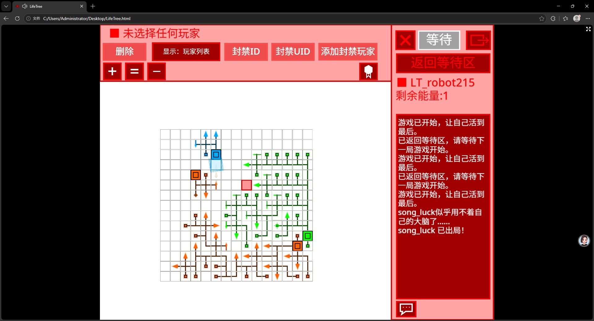

可以看到一堆树形的生物在打架，里面方形的细胞就是负责**生长**的，箭头形状的细胞就是负责**攻击**的。此游戏有**回合制**，`LifeTree 0.3.0+` 版本推出了无回合模式。在回合模式中，每回合你可以调用一个细胞，方形的生长干细胞在每回合可以在周围三格长出新的干细胞和任意方向的刺细胞，刺细胞可以将前方两格的所有东西攻击掉，如果这棵树的大脑（也就是根）被攻击了，那么这个玩家就**出局**了。无回合模式则拼手速，当然还有资源的调配。`LifeTree 0.3.0+` 推出了更多的细胞，将游戏玩法推向了一个新的高度。所以群雄纷争，就看花落谁家了。  
> 提示:  
因为song_luck公开了所有历史版本，所以以后的介绍如果非版本通用都会附上有效的历史版本，请大家注意甄别。为防止歧义，对于版本号比如 `x.y.z+` `x.y.z-` `a.b.c~d.e.f` 这种规定为包含自己（闭区间）。

## 快捷目录
为了玩家阅读方便，我在这里制作一个该文档的快捷目录：
- [游戏规则](#ii-玩法介绍)
- [UI控件介绍](#i-ui操作)
- [联机教程](#five-联机介绍)  
- [开源协议](#分层开源授权说明)  

还有这些:
- [快捷目录（？）](#快捷目录)
- [不要点开你不信任的超链接！](https://www.bilibili.com/video/BV1GJ411x7h7/?spm_id_from=333.337.search-card.all.click)
## 游玩方式
### I. UI操作  
#### one 主菜单  
点开游戏，映入眼帘的是游戏的主菜单，如下图：  

  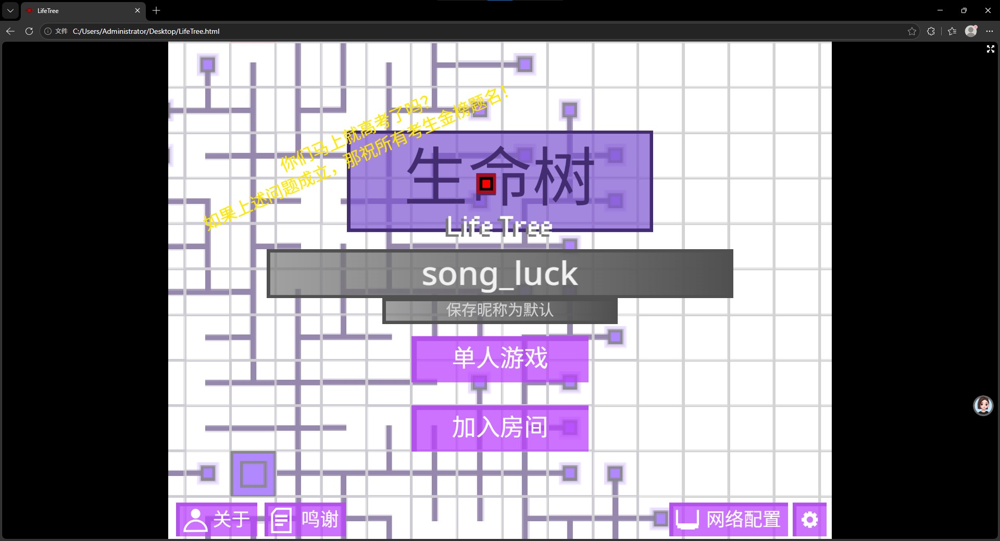

>图为 0.2.0 版本截屏  

主界面控件分为以下部分：
1. **中间的灰色名字框**  
它是用来修改你的游戏昵称的，第一次游戏启动时昵称默认为“LT_Player” + 0~9999的随机数字，点击灰色大框可修改昵称，最多支持23个字符。下面小框的“保存昵称为默认”可保存昵称，下次启动游戏就不用再改昵称了。  

2. **单人游戏**  
顾名思义就是单人游戏，但是多人游戏开设房间也在这个控件里面。  

3. **加入房间**  
顾名思义就是多人游戏的加入房间，可以靠房间号加入房间。

4. **左下角的“关于”和“鸣谢”** `LifeTree 0.2.0+`  
介绍本游戏的简略信息和鸣谢名单。

5. **右下角的齿轮**  
这是设置，可以调整一些选项，如音量，背景亮度等。

6. **齿轮旁边的网络配置** `LifeTree 0.3.0+`  
这可以配置联机使用的 WebRTC 参数。

7. **标题左上角的闪烁字幕** `LifeTree 0.2.0+`  
这算一个彩蛋，在特定的时间会弹出一些字幕，这些字幕可能跟当时所发生的事件有关（比如song_luck截图的时候正值6月份，此时中国地区正在高考）

#### two 单人游戏
第一次启动游戏时，从主菜单点进单人游戏后你会看到如下界面：

  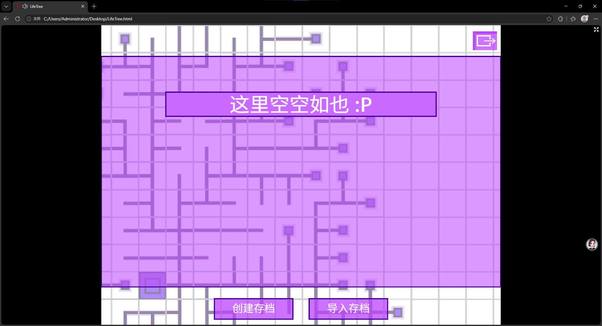

当你无任何存档就会这样，点击下面的“创建存档”即可创建存档，或点击“导入存档”把存档文件导入。之后你会看到这样的界面：

  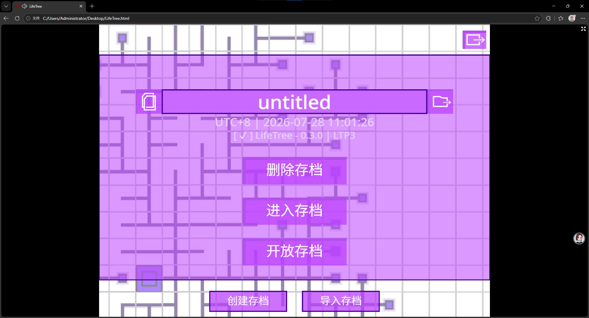

界面有以下控件：
1. **退出**  
右上角就是退出该界面，其他界面也有这个按钮，后面不再多说。

2. **存档名**  
最上面的长条是存档名，点击即可修改，默认为 `untitled` 。

3. **复制与导出**  
左边纸张图案按钮为复制存档，点击可复制一个存档。右边文件夹加一个箭头的是导出存档，点击可以把存档导出成 `.LTA` 文件，可搭配下面的导入按钮使用。

4. **删除存档**  
顾名思义，但是为防误触这个删除存档要长按才行。

5. **进入存档**  
顾名思义，点击就进入存档了

6. **开放存档**  
这是给多人联机用的，点击可以把自己存档开放，你会获得一个房间号，你也会成为房主。

7. **创建存档和导入存档**  
顾名思义，但是导入存档要你把 `.LTA` 文件拖入窗口。

8. **翻页**  
如果你的存档多的话它在界面左右两边有左右箭头，点击可以切换存档。

9. **时间显示**
在存档名下面，会显示你上次保存地图的时间以及时区（时区是因为song_luck刚做这个功能的时候以为每个时区的时间戳都不一样而加入的，现在看来这玩意唯一作用就是猜出你的地理位置）

10. **版本显示** `LifeTree 0.3.0+`  
在时间显示下面就是版本显示，可以显示你上次保存地图的版本，格式为 `<前缀字幕> <游戏版本>|<协议版本>` ，但是在 `LifeTree 0.2.0-` 版本并不会像存档写入自己的版本，所以你会看到你的旧地图版本为 `unknow` 。如果版本信息跟你现在的游戏版本对不上，那么字幕会变成黄色或红色提示你。

  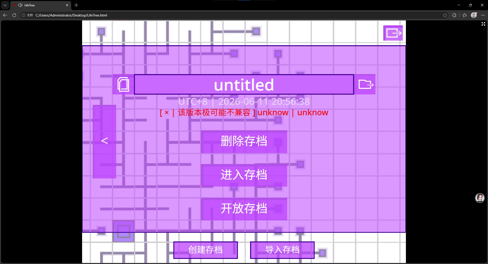

#### three 游戏等待区
> 注意：这一部分作者UI制作比较抽象，请谨慎观看。

当你进入存档后，你看到的是这样一个界面：

  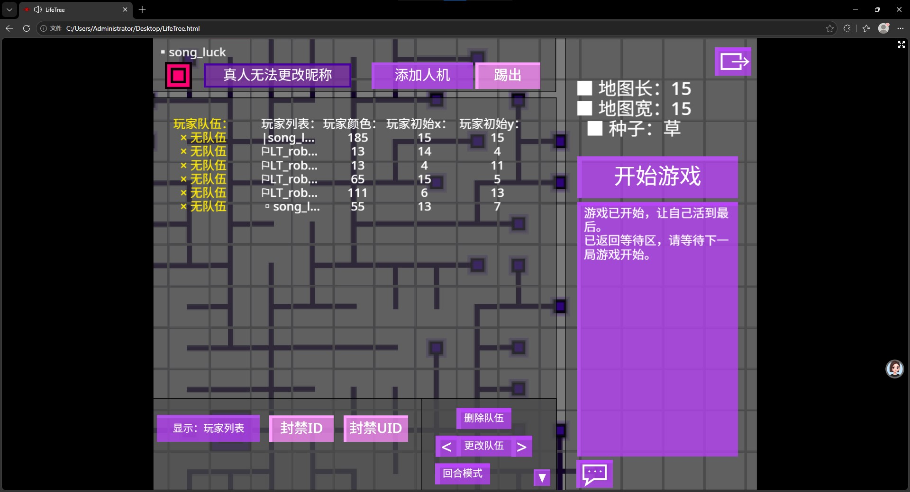

UI有点多，我一个一个介绍。

1. **玩家列表**  
首先中间的一大块就是玩家列表，它里面显示了5个玩家信息：玩家队伍、玩家昵称，玩家颜色，玩家初始位置（x和y）。在玩家列表中有一个光标选择，被选中的信息前面会显示个竖线“|”（比如列表中第6个玩家的昵称就被我选中了），使用方向键或者WASD就可以移动光标，如果是手机触屏的话可以拖动左上角的方块移动光标（我知道这样有点奇怪）。玩家名字前面的符号也能表示一些信息，如果名字前面是实心方形就代表他是一个在线的玩家，如果是空心方形，就代表他是一个不在线的玩家，如果是旗子那就代表他是一个人机。

2. **人机昵称更改或者数值滑条**  
如果光标在人机的昵称上面点击左上角的长条就可以更改昵称，但如果选中玩家的昵称那么不可更改。如果选中后面3个数字属性的话这个长条会改成滑动条，拖动滑条就可以设置对应属性。

3. **队伍设置** `LifeTree 0.2.0+`  
队伍属性是不可被光标选中的，需要下面偏右的几个按钮设置队伍（主要原因是队伍功能加入比较晚，不想弄原有架构了），点击“更改队伍”会弹出个询问框，输入对应队伍名字就可以了，点击“删除队伍”可以让玩家回到无队伍的状态，点击“更改队伍”左右的箭头可以快速为玩家选定队伍，不需要自己输入。

4. **地图大小设置**  
界面的右上方有地图长和地图宽的设置按钮，点击对应的字幕旁边的方块就会弹出个询问框，这样就可以设置竞技场地的大小了。

5. **移动玩家**  
地图最下面靠右的位置，有上下两个箭头，点击对应的箭头可以把选中的玩家上下挪位置，这将会决定玩家的回合顺序。

6. **添加人机**  
就在正中间最上面的按钮，顾名思义点击就可以生成一个人机。

7. **删除或踢出按钮**  
添加人机按钮右边有一个按钮，如果你选中的是人机它将会变成“删除”，在多人游戏中如果选择的是在线的玩家它将会变成“踢出”，反正功能按字面意思理解也不难。

8. **聊天框**   
屏幕右边的方块就是聊天栏，里面会显示一些聊天信息，点击聊天栏下面的气泡符号的按钮，就会弹出一个询问框，输入即可发消息，这在多人游戏有很大用处。在多人游戏里面战况开始后，选中以后它的UI会改变成  ，你继续发消息，你就会发现，你说的话只有他能听到了。私聊也一般会显示，私聊会显示成：
> [<玩家昵称>] 悄悄的对你说: <消息>

9. **封禁三幻神**  
在UI的左下角有三个按钮，第一个是“显示：玩家列表”，点击它可以在“显示：ID封禁列表”与“显示：UID封禁列表”切换，上面玩家列表显示内容也会跟着变，具体就是列出哪些玩家ID被封了，哪些玩家UID被封了。第二个是封禁选中玩家的ID，ID被封之后对于这个地图该玩家将无法进入，但是改昵称仍然就可以进入了（因为此游戏的ID生成受昵称影响），此时此刻你就可以点第三个“封禁UID”，被封禁UID的玩家就算改昵称也没用（因为此游戏的UID是在第一次启动游戏时生成，之后就一直不会变的，但是靠技术手段仍然能绕过，这点作者也没想出什么好方法应对。）  

如果你显示的是封禁列表的话，你会发现这里面陈列着被封禁的玩家。如图所示：

  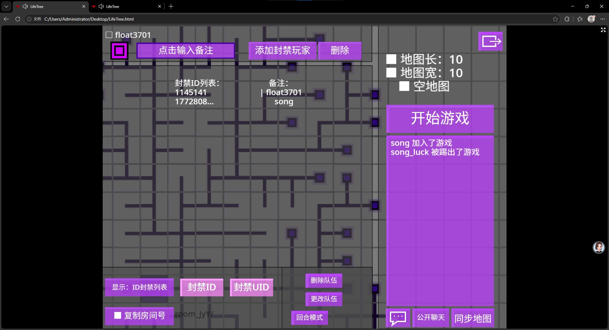

添加人机按钮会被替换成添加封禁玩家，点击它会弹出一个询问框，在这里面输入对应玩家的ID/UID（得看你显示的是封禁玩家ID还是UID列表）就可以达到封禁的效果。旁边的备注是方便房主记忆的，封禁玩家的时候，备注默认是该玩家的昵称，选中备注点击上面的输入备注就可以更换他的备注。如果你想“开始游戏”，那么就直接点击聊天框上面的开始游戏按钮就可以了。

10. **地图种子** `LifeTree 0.3.0+`  
在地图大小设置下面，使用它可以自定义地图种子，供柏林噪声生成地图地形，种之为空就啥都不生成，并且它会显示为 `空地图` 。

#### four 游戏开始

当游戏开始的时候，你就会发现UI的主题色从紫色变成了红色（这也是个历史遗留问题，但我不打算修了）。我打算就用开头的图片展示UI，毕竟我不想在文件夹 `images` 里面塞一些重复内容。

  

在游戏开始的时候，我们可以使用WASD或者方向键进行视角的移动，对于触屏也可以选择直接拖动地图，可以使用键盘上的加号、减号键进行地图的缩放（不用按住shift）。实际上，这里面很多控件都跟等待区一模一样，我就不重复介绍了，先把一些没有的东西介绍一遍：

1. **玩家显示**  
你点击地图里面的一个方块的时候，你会发现这个方块变成了红色，这就代表你选中了这个方块。如果你选中了一个玩家的某个细胞，最上面的字幕就会显示该玩家的名字。但实际上，你点左上角的方框可以快速选中玩家，多点几次就可以切换你要选择的玩家，并且视角自动对准该玩家大脑的位置，上面的5个按钮也就可以对该玩家使用了。

2. **缩放** `LifeTree 0.2.0+`  
点击上面的加号和减号可以实现地图的缩放，点击等号就可以切回原来的大小，不过这是为触屏玩家准备的，电脑一般用不上。

3. **排行榜** `LifeTree 0.2.0+`  
在“添加封禁玩家”按钮下面有一个徽章标志的按钮，这就是排行榜功能。点开可以打开排行榜，再点一下就可以关闭。每局结束后排行榜会自动展示，里面会显示玩家的排名（不只是看你多久出局的）、存活回合数和击杀数等信息。排行榜打开的时候你能看到一个一个玩家快速的填入排行榜，这算是特效的一部分，但是根本原因是我使用的是最原始的插入排序，虽然我会，但是我不想使用快速排序或归并排序等技巧了。

  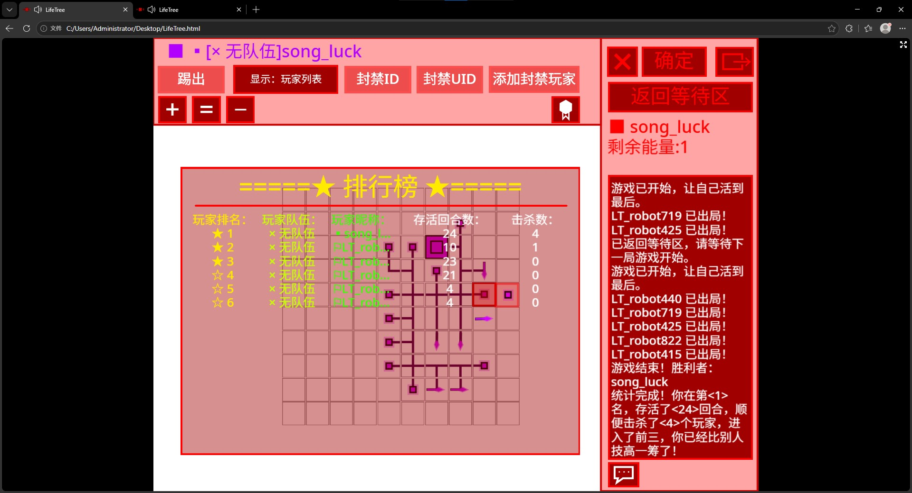

4. **确认**  
它是右上角的“等待”按钮，在每回合当你选择好你这回合要做什么的时候点击确认键，就可以做出这个行为了。如果回合没轮到你，那么这按钮就会变成灰色的“等待”，如果你在一回合内什么都不选直接点这按钮就相当于你放弃了这一回合，在这回合你什么都没做。

5. **返回等待区**  
在等待按钮下面，顾名思义就结束掉这场游戏直接返回到等待区，然后重新开始游戏。

6. **该回合玩家**
在界面的右上角，会显示该回合玩家的名字，点击旁边的小方块还可以定位到该玩家的大脑。

7. **能量显示** `LifeTree 0.3.0+`  
在 `LifeTree 0.3.0+` 版本中，回合模式下一回合可能走多步，待会合还剩多少步就显示在该回合玩家下面。如果模式为无回合模式，那么它将会显示在左上角，如图所示：

  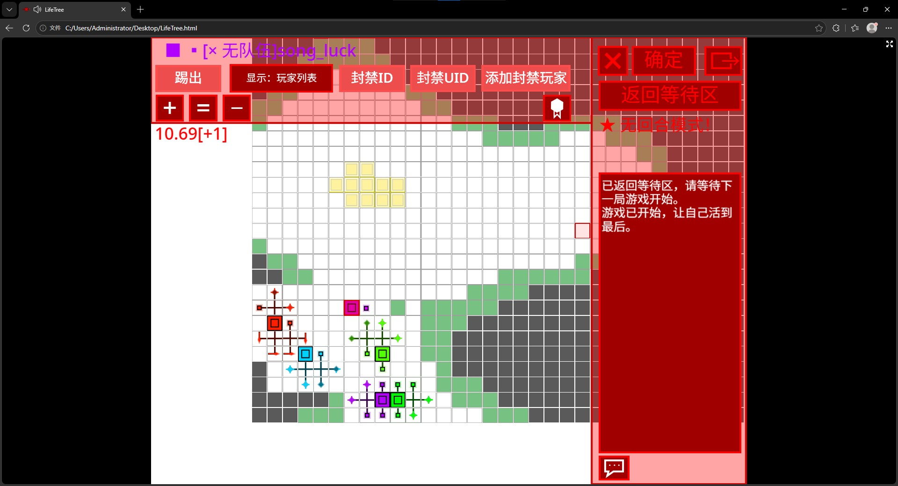

其中左边的数字是你的能量，右边的数字是你的能量增数，可以由藻细胞改变（下面会介绍）。

#### five 联机介绍
一个回合制竞技类游戏怎么能少得了联机功能呢？所以作者还是给他做了进去，但是我先提前告知一下：
> ⚠️ **由于作者在 `LifeTree 0.2.0-` 中技术不成熟，联机功能说崩就崩，甚至可能毁掉存档； `LifeTree 0.3.0+` 中虽然引入了先进的WebRTC技术，但是可能还是有很多神奇的隐藏bug。请大家谨慎使用，最好联机前备个份。**

好了，让我们正式介绍联机部分吧!  
首先，如果我们想要联机，那么可以选择一个房主，这个房主开放地图，另一个玩家作为房客加入地图，像这样子就可以实现联机了。首先调到需要开放的存档界面：

  

里面最底下有一个开放存档，我们点进去就会出现这样的一个界面：

  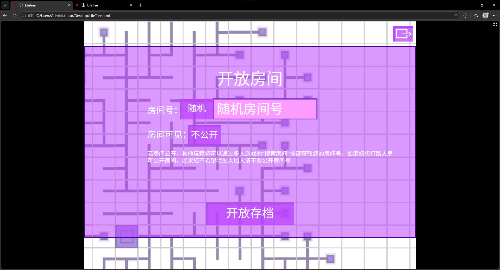

这里面主要有三个控件:
1. **房间号设置**  
房间号默认是随机生成的，但是这个游戏支持自定义房间号。你现在点击输入框是点不了的，但你只需要点一下输入框左边，将“随机”设为“自定义”就可以自行输入房间号了了。但 `LifeTree 0.2.0-` 自定义房间号功能不是很成熟，如果你设置的房间号跟另外一个已经存在的房间相撞了可能会导致非常严重的问题，所以能不搞还是不搞。 `LifeTree 0.3.0+` 使用了房间防撞机制，检测到撞房间了那么后创建房间的人会自动关闭房间并保存，这样子可以避免一些严重的问题，但是体验可能不好。

2. **房间公开**  
房间号下面就可以调整房间私密性，一般是不公开。如果房间设为公开，这就意味着其他人能直接在游戏内搜到你的房间，适合那种比较喜欢招揽路人过来打路人局的人使用。不过需要提到的是这项技术仍然不是很成熟，虽然出问题了没有房间号设置那么严重，但是因为某些原因，你就算公开房间了别人也小概率搜不到，你公开的房间号可能会因为某些原因被覆盖。

设置完这些，你就可以直接点击开放存档了。开放存档之后的UI如下：

  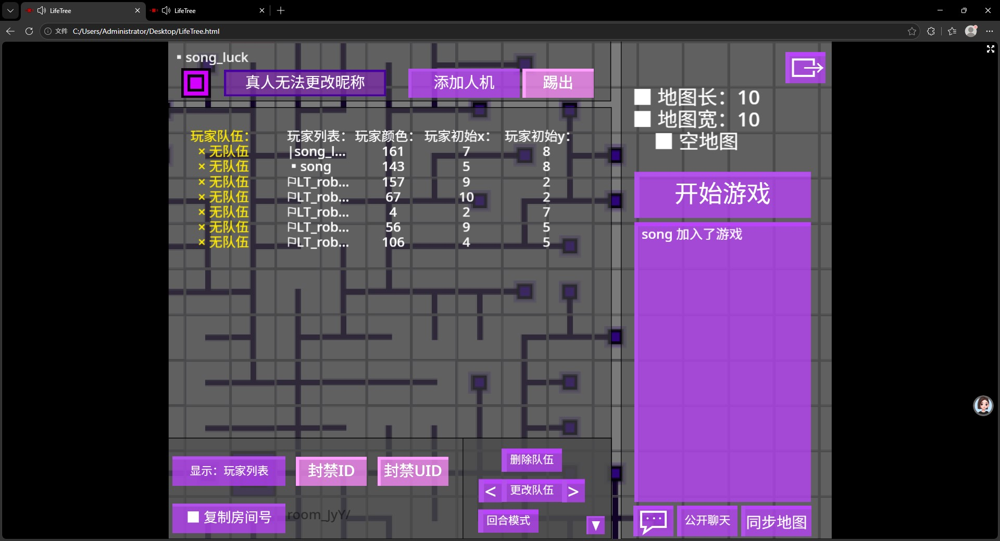

跟你单人游戏的UI还是有点区别的，具体多了这几个控件：

1. **房间号查看**
最左下角多了个“复制房间号”按钮，点击就可以将房间号复制到剪贴板，旁边用灰色的字写着的就是你的房间号（要把前面的 `room_` 去掉）。

2. **聊天状态设置**  `LifeTree 0.2.0+`  
右下角有一个“公开聊天”按钮，这实际上显示的是目前的聊天权限。点击它就可以在“禁用私聊”和“禁用聊天”进行切换。禁用私聊可以让玩家只能发公开消息，禁用聊天就是全部禁言。

3. **同步地图**  
这是一个比较重要的功能，在现在的极不稳定的联机协议下很容易因为网络动荡使得所有玩家地图不同步，点击这个可以让房主直接下发自己的游戏状态，所有人就会依此校准。这属于是一个向技术妥协的产物，后面如果作者开发出了更好的联机功能，这个功能就可能会随时删除（ `LifeTree 0.3.0+` 已经将底层更换成了WebRTC，但是为了防止隐性bug，也保留了这个按钮）。还有一点就是点击的时候不要频繁点击这玩意，不然你家的宽带会炸的。

房主端说完了，接下来就看看另一个好基友作为房客该如何加入游戏了。首先点开主界面的加入“房间”按钮，映入你眼帘的就是如下的UI:

  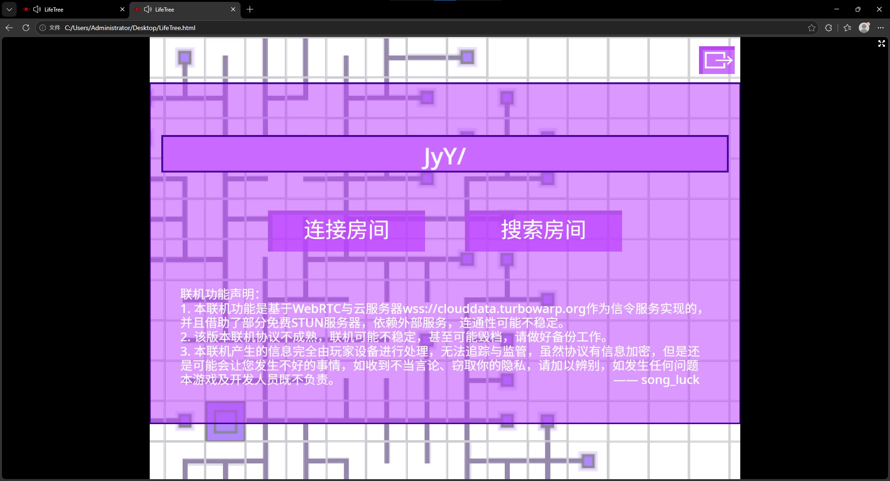

依旧先介绍一下控件:
1. **房间号输入框**  
就最上面的长条子，没什么特别的，点击输入房主给的房间号就行了。

2. **连接房间**  
输入好房间号之后点击连接房间你就可以跟房主联机了，因为协议不稳定一次联机可能连不上，需要多试几次。点进去之后游戏会花几秒钟的时间跟房主进行协议握手、密钥交换、数据同步等操作，之后就会进入游戏界面了：

  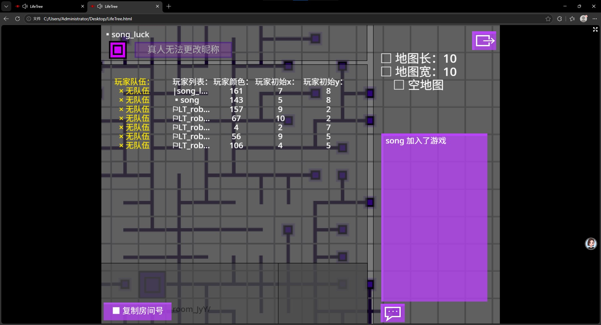

界面里面有啥我就不介绍了，其实就是比房主少了很多功能，比如作为房客，你不能随便乱踢人了等等。

3. **搜索房间**  
这功能有点硬核，通过这个你可以随机搜索到私密状态为公开的房间，如果你想跟其他人打路人局可以使用这个功能。点击之后他会花很长一段时间对房间进行搜索，但是因为要校验房间的存在性所以搜的特别慢，如果搜到了，它会把结果自动复制在房间号输入框中。不过我还是必须在这说一下：

> **⚠️ 你在这里面能搜到的房间五花八门，可能有的房间氛围不是这么友好，所以搜索房间的时候我建议你谨慎点，因为你永远也不知道你进入的是什么样的一个房间，不过如果你执意要搜索的话，因为这个产生的任何问题，本游戏及开发人员既不负责。**（疯狂叠甲ing）

4. **自定义网络配置** `LifeTree 0.3.0+`  
还记得主界面有一个网络配置的按钮吗？接下来就讲一讲这东西，用好这东西可以让你的联机游戏更加通畅，但是这里面涉及到的道理有点深奥，如果你是非技术人员，不知道这东西到底在干什么那么最好别动它。首先点进主界面的网络配置会显示以下界面：

  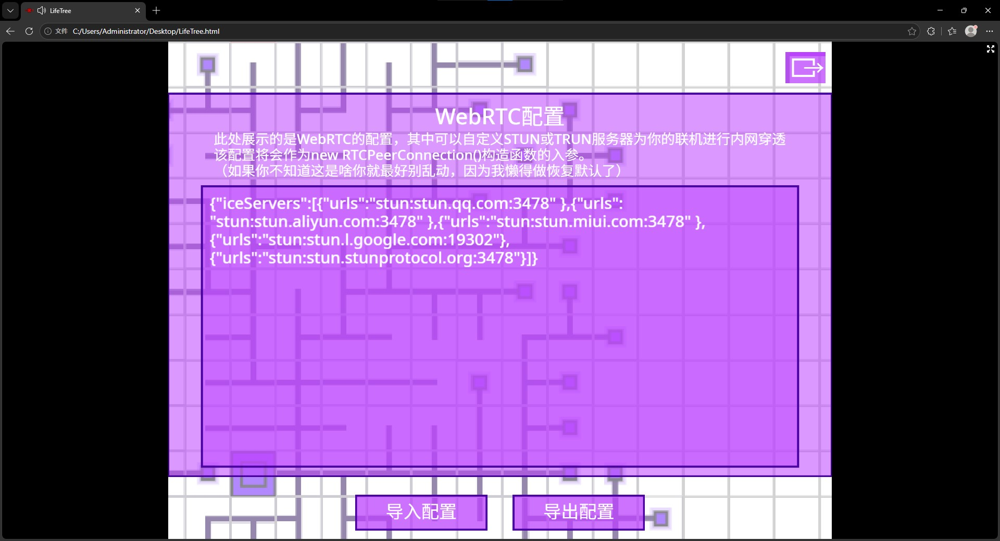

这里面有一串JSON文本，可能有的搞前端的同学看出来了，这就是WebRTC的配置。游戏在 `LifeTree 0.3.0+` 将使用WebRTC联机，这种联机好处是不用经过任何中转服务器，可以把延迟降得很低（原版云变量的5秒延迟有点太吓人了）。但是因为现在IPv4+NAT的网络架构很难实现自主进行连接，所以必须得有个服务器来帮我们做穿透，在默认配置中定义的就是这些，我从国内和国外分别薅了一些免费的STUN服务器进行穿透，但这种局限性很高，比如像校园网之类的对称NAT就没法联机。这时候大家就可以自定义配置，加入更好的STUN服务器，或者在整个TRUN服务器保障联机的成功率。我们可以点击下面左边的导入配置按钮，将一个 `.json` 文件拖进去，就成功设置好了；点击导出配置可以将现在游戏保存的配置导出成 `.json` 文件。技术性方面，当游戏建立 `RTCPeerConnection` 的时候会把你的配置当做 `new RTCPeerConnection()` 的参数导入进去，实现自定义网络配置。

### II. 玩法介绍
在 `LifeTree 0.3.0+` 有两种模式：回合模式和无回合模式。在等待区下方有按钮可以切换模式。在回合模式中大家都轮着来，轮到你的回合的时候你就可以调用自己的细胞。在无回合模式中拼手速，左上角会显示你的剩余能量，如果能量不够那你就啥都做不了。

在 `LifeTree 0.3.0+` 开始游戏的时候，如果你输入了种子那么游戏就会通过柏林噪声生成地形，如图所示：

  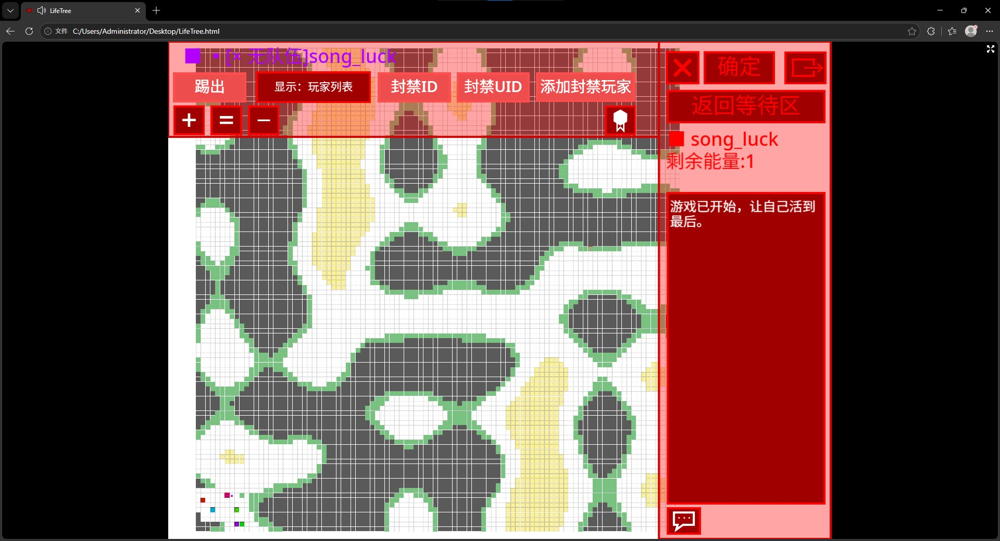

当然，这是大地图下的地形，如果地图比较小，那么地形就会显得特别细碎。其中有很多灰色的东西，那是石头，可以作为障碍，当然也可以被攻击掉。黄色的是阳光，这玩意比较有用，后面讲藻细胞的时候会提到这个，阳光可能会成为每个人资源的争抢点。绿色的东西就有点阴了，那个名字叫地衣。被这东西覆盖的地方根本不会显示敌人，相当于躲在里面就可以美美隐身。躲在里面你们只能打盲战，完全看不到彼此，这就是最阴的一点。在一场对局中如果你整个队伍都沦陷了，那么作为旁观者，你可以看到躲在地衣里面的其他人，但是如果你死了，想给队友报点，那不行，因为你整个队伍还没沦陷，你根本看不到他们。给你看看躲在地衣里面美美隐身的玩家：

  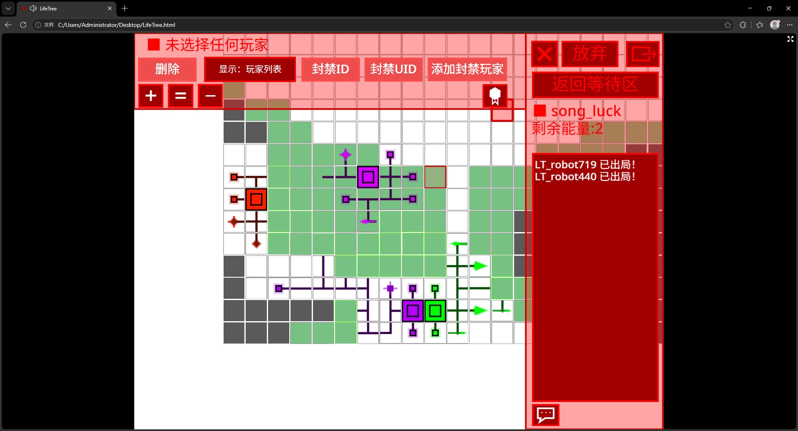

可以看到我周围玩家在地衣里面的部分全没有显示，我虽然看得到自己，但是这些玩家也看不到我，黑暗森林法则这一块。

开头说了，在这个游戏里面每个玩家扮演一个树状的真菌靠着一堆细胞发育、防守、攻击，我们一共有以下几种细胞：
1. **脑细胞**  
  
一个巨大的方形脑袋，看着不太聪明的样子，开局固定刷新的NPC，但是它是判定胜负的关键。脑细胞作为整棵树的根，如果这玩意没了，游戏就会直接判你出局。  
它可以在周围四格中的任意一个方向延伸出一个生长干细胞，但是也只能延伸出这一种细胞。游玩的时候我们可以选中脑细胞，对着它的位置多点几次就可以控制往哪个方向延伸干细胞了。

2. **生长干细胞**  
  
一个比较小的方形啾啾,但是作用同样不可忽视。它可以在周围三格生长新的生长干细胞或任意方向的次细胞，这三格每一格都是独立的，你生长出来的新的干细胞可以继续生长，达到延伸的目的。  
选中一个生长干细胞，我们就会发现它周围三格可以点击“被挡住的除外”，点击任意一格就可以切换这一格的细胞，像这样子我们可以把这三格都可以设置好生长什么细胞。

  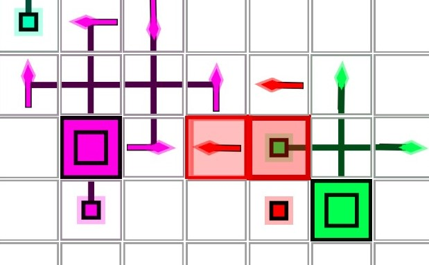

> 选中的干细胞周围会出现细胞的预览，我们只需要点击这些预览的细胞虚像就可以切换细胞了，点击右上角确定就可以生长了。

3. **刺细胞**  
  
这东西就纯攻击型的，看这玩意的纹理就知道它不好惹。我们选中该细胞，点击确认，它就可以直接清掉前面两格的细胞了，攻击的事全靠它。（这玩意可以瞄准自己，也可以攻击自己，但是如果你实际游玩的话，你就会发现这点会有大用处。）

> 以下的细胞所在的游戏版本都为 `LifeTree 0.3.0`  

4. **箭细胞**  
  
这东西跟刺细胞差不多，但是射程高达30格。不过肯定有缺点，首先，它没法穿透，有个方块挡一下就没了。其次，它是一次性用品，发射一发它自己就没了。所以这东西还是比较适合作为远程骚扰人的东西。

5. **藻细胞**  
  
这东西就是重头戏了，你可以看到我连续放了5张图，使用它就可以发育一次，发育程度就看图，当最中间的菱形变亮了就说明发育成功了，一共要花四步进行发育。发育成功之后他就没办法使用了，但是在回合模式中每回合会额外给你一步（步数后面称为能量），相当于你如果发育好了 `N` 个藻细胞你一回合就可以走 `N+1` 步。在无回合模式中它会提高你的能量增速，每秒会为你生产0.1单位的能量，并且不管在什么模式下如果待在阳光中那么生产效率是原来的3倍，这玩意就是新版本你跟别人拉开差距的关键。

6. **脂肪细胞**  
  
这东西也不是吃素的，如果你发现一回合你有的步数用不完，你就可以给他存着。选中脂肪，它会有两种行为，有一个图标指示你选择的是哪个行为，一种是箭头朝方块里面的存入，一种是箭头朝外的释放，多点几下就可以切换。你可以将剩余的能量存进去，等到需要的回合再拿出来，最多只能存储6个能量。如果玩得好，在回合模式中可以前面先每回合存一小点，等到某个回合，直接把大量的能量取出来，在这一回合大杀四方，实现时间停止的效果。

7. **突刺细胞**  
  
这个东西原始定位是钻头，可以在墙壁上打洞。调用它的时候需要三格能量，然后它会向前延伸一格，前面横向三格的方块全被破坏。这玩意不能拐弯，不过能解决LifeTree当中在石头墙上打洞比较困难的问题。但是用得好的话，这东西可以当成战斗细胞大杀四方，毕竟原本工程用的推土机配一把枪也能当坦克使是吧（）。

8. **胞间连丝**  
  
这个细胞贴图有点诡异，但是他却是和平的使者。它和脂肪细胞一样有两种状态：运输和取用（运输的图标和脂肪细胞释放的图标一样，取用的图标就一个黄色方块）。将它的正前方对准其他玩家的该细胞（要贴着啊），然后选择运输，你会发现你自己的能量跑到了其他玩家的该细胞中，如果别人把能量运输到你的该细胞中选择取用就可以像脂肪细胞一样把能量拿出来了，最多储存四格能量。这东西可以向你的队友输送能量，也可以向你的敌人输送能量，在混战中结盟的时候就可以使用这个来表达自己的诚意。

9. **荚膜细胞**  
  
这东西是一个防御性的细胞，刚长出来的时候形状有点像……呃……激光炮？长出来后可以花三个能量调用它，然后他就从激光炮变成了……呃……三角梅？这时候他就可以防御一些攻击了：刺细胞没法攻击这个细胞，但是它可以穿透攻击到后面的枝干；箭细胞能直接被这东西拦下，还有后面要说的毒刺细胞也能被这东西拦下，他就是个纯防御性的壁垒。但是如果你突刺细胞叔叔来了照样给铲没。

10. **毒刺细胞**  
  
毒刺细胞虽然名字长得跟刺细胞很像，但是它的行为更像箭细胞，但是射程只有十格，并且机动性不好（没有箭细胞的灵活方向），但是它有穿透攻击，花六个能量调用一下前方10格的方块直接没了。当然它也是一次性的，并且要被三角梅……啊呸，荚膜细胞克制，但是一击命中别人大脑倒是挺爽的，这一击，将贯穿星辰。

11. **神奇地衣**  
  
看图像倒是晶莹剔透，花两能量调用它它自己就没了，然后以它为中心5×5的地方将铺满地衣，依旧美美隐身。

12. **硝酸甘油细胞**  
  
长得跟藻细胞有点像，但是这东西却是一个烈性的。花6能量调用它它就炸了，周围5×5的地方全炸没了，甚至连地衣覆盖的地方都要炸秃。所以调用的时候不要炸到自己了，炸到自己，那就是引火自焚了。

像这样子，我们就可以进行扩张和攻击了，目标是最后一个人或者最后一个队伍存活。相同队伍的人互为朋友，剩下一个队伍存活就游戏结束了，有的人也可以不加入任何队伍，那么他就以全世界为敌。  
接下来是一些令人毛躁的细节（因为这些细节我在给别人介绍规则时好多人都没听懂，并且说我游戏规则太复杂了，不能理解），为了方便理解，直接上图：（这是清朝老版本的图了，所以你会发现很多控件都没有）

  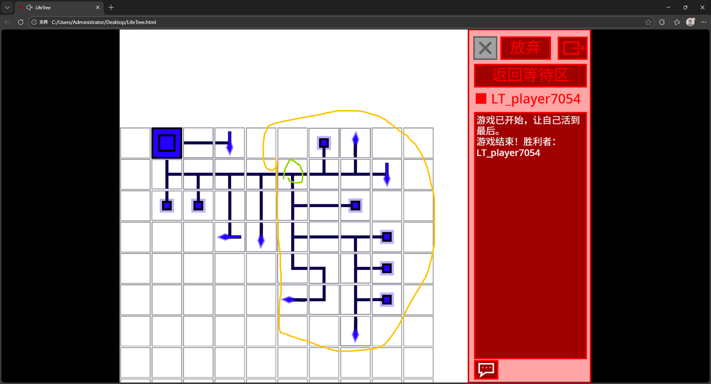

这是它延伸出来的一棵树，假设我用上帝之手把绿色圈出来的这个枝干点没了，那么它会发生以下两件事：  
1. 黄色圈出来的这一部分全都要没。
2. 绿色左边的枝干形状会从“┬”变成“┐”

很多人就搞不懂为什么了，不过我感觉这很好理解，第一项相当于就是一个节点没了，以这个节点为根的子树也全没了，第二项也就是连通性的问题，把枝干想象成 Minecraft 的红石粉会更好理解。

---
以上就是关于这个游戏的全部介绍了,还有本游戏的开发者 **song_luck** 是一个**16岁的高中生**，很多地方可能都不够专业，**不喜勿喷^_^**。

如果你们喜欢的话点一下右边的 Star ，有什么建议或者漏洞报告的话可以发在 Issues 上面讨论，如果有时间的话，我尽量会回复的。

## 分层开源授权说明
本项目采用多协议分层授权，不同资源约束不同：
1. **程序代码（HTML/JavaScript/Electron脚本/sb3文件/所有自定义扩展文件）**  
遵循 [Apache License 2.0](./LICENSE-APACHE)
可自由修改、商用、分发；修改文件需标注变更，保留原版权声明。

2. **UI矢量图、界面贴图、短交互音效（Electron文件夹中的 `LifeTree Desktop\resources\app\assets` 中的所有图片文件和 wav 文件）**  
完全宽松开放许可：允许任意复制、修改、商用、二次分发，无强制约束，建议标注原项目 `LifeTree` （无法律约束，仅为建议）。
  
3. **原创背景音乐（Electron文件夹中的 `LifeTree Desktop\resources\app\assets` 中的所有 MP3 音频和 sb3 文件中角色 `animation` 的所有音频）**  
遵循 [CC-BY-SA 4.0](./LICENSE-CC-BY-SA)
- 允许商用、改编、二次传播；
- 必须清晰署名原作者与本项目；
- 改编后对外发布的音乐作品，必须同样使用CC-BY-SA协议开源。

## 鸣谢
此条目在游戏内置，主界面点击“鸣谢”即可查看：

  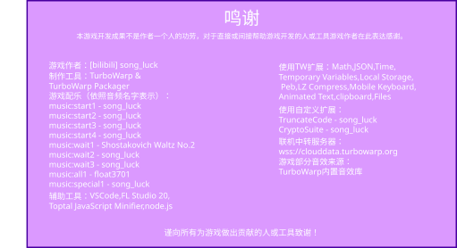

